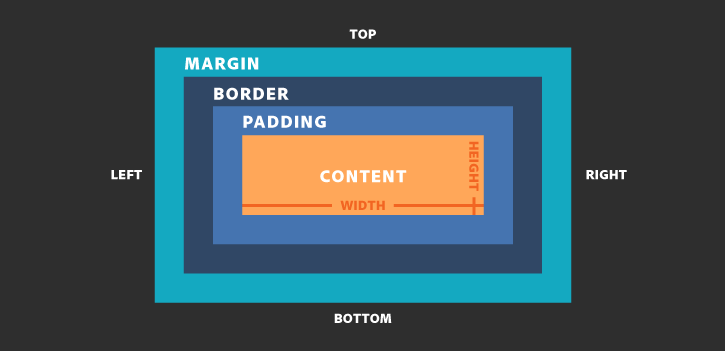
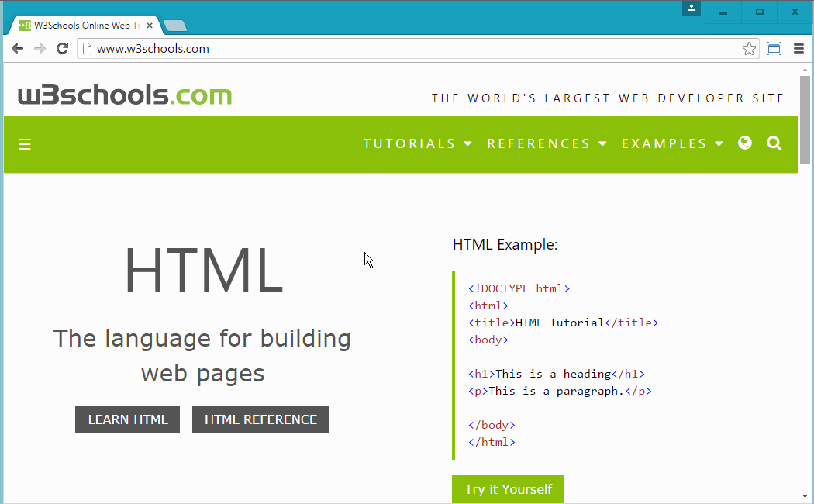



# Box Model

*****

**Objective:** By the end of this lesson, the student will use the box model to adjust the layout of a webpage.

**Assignment:** Image Gallery

*****

### Overview

Each of our HTML Elements represent an *object thing* that has multiple **properties** on it set usually to `null` and we use CSS to change the **value** of those **properties**. It turns out that each of these elements/*object things* has properties that determine it's `width`, `height`, `margin`, `border`, and `padding`. These 5 properties put together can be visualized as something we call the **Box Model**. You've actually already come into contact with these properties without knowing it. In your CSS code, it looks like this:

```css
  .has-border {
    border-radius: 25px;
    border: 2px solid #0795C3;
    padding: 20px;
  }
```

Notice the properties: `padding`, `border`, and `border-radius`? These are a few of the properties within the [Box Model](http://learn.shayhowe.com/html-css/opening-the-box-model/) *thing*.

Take a minute to watch this overview of the power of the [Box Model](https://www.youtube.com/watch?v=9r2dYgpxCd4)

<iframe width="560" height="315" src="https://www.youtube.com/embed/9r2dYgpxCd4" frameborder="0" allow="accelerometer; autoplay; encrypted-media; gyroscope; picture-in-picture" allowfullscreen></iframe>

*****

## Box Model Properties

Each HTML **Block Element** has these properties available to be given different values. read each description, then take a look at the illustration below.




### Border

* `border` is the actual border *between the inside and the outside* of the element. Normally it's set to `null` which means you can't see it unless you change it's value like so: `dotted red 1px;` which would create a red dotted line that is 1 pixel wide around the selected element.

The `border` property used to take three values: `style color width` like this:

```css
  p {
    border: dotted red 1px;
  }
```

<!-- But recently, CSS has changed to make this more readable and now we have three different properties:

* `border-style`, that takes values like `solid`, `groove`, `dashed`, etc.
* `border-color`, that takes values like `#fff`, `green`, `#096691`
* and `border-width` which takes values in pixels or `px`, i.e. `1px`, `5px`, etc. -->


 **Although an element's `border` is bound to the element itself, `border` settings will still **push outward** affecting the element's neighbor(s)**.  

For an example, an element has an original width of 100px and a height of 150px.  If you then assign a 5px border to the element, this will increase the elements total size.  The new width would be 110px(5px on each side) and a height of 160px(5px on both the top and bottom.)
 > *NOTE: Checkout your Docs below to see all the values these properties can take.*

### Margin

* `margin` is the space *outside* of the element, beyond the border. It separates the element from other elements.

Beyond the edge of the border lies the `margin`. If you add margin to any side of an element, it will *push against* other elements near it and create an invisible barrier between the elements. If you were looking at an image gallery the margins would create the gutter between each column and row of images.

> *NOTE: In **ALL** of these properties you're learning, the order of the values matters. We didn't say anything about order when we discussed the `border` property but it applies there to! Below you'll see descriptive **class selectors** describing the order of the values: `.TopBottom-LeftRight` helping the human-eye understand "Top & Bottom margin then Left & Right margin"*

```css
/* In this example, 15px of margin will be applied to all four sides of the element */
.margin-on-all-sides {
  margin: 15px; 
}

/* In this example, 15px will be applied to the TOP and BOTTOM margins, 30px to the LEFT and RIGHT margins*/
.TopBottom-LeftRight {
  margin: 15px 30px; 
}

/* In this example, 15px on the TOP margin, 30px on LEFT and RIGHT margins, 45px on BOTTOM margin*/
.Top-LeftRight-Bottom {
  margin: 15px 30px 45px; 
}

/* And finally, the TOP margin will be 15px, the RIGHT 30px, the BOTTOM 25px, the LEFT 20px */
.Top-Right-Bottom-Left {
  margin: 15px 30px 25px 20px; 
}
```

> *Hint: in this last example, it helps to remember that you start at the **top** and go **clockwise***

**But wait!** You can do this a different way that may be more understandable, just use the more specific properties:

* `margin-top`
* `margin-right`
* `margin-bottom`
* `margin-left`

Which, of course, do the same thing but with a little more typing that results in far more readable code!

### Padding

* `padding` is the space *inside* the element between the border and the content/text inside the element. Think of it as the styrofoam padding inside a box protecting the goods inside.

**Padding** is the space between the element's border and the content itself. You can think of it as being like an "inner margin". If you had a bird's-eye-view of a pool table, you can think of the padding as the cushions or banks between the outside border(wood frame) and the content inside (billiard balls, pockets, green space).

Check out these examples of **Shorthand Code** below. The first one has only 1 value but the second one has 2 and the third had 4 values. The order of these values matters because, again, it translates to *ALL SIDES* if only one value is present, *TOP/BOTTOM then LEFT/RIGHT* for 2 values, and *TOP, RIGHT, BOTTOM, LEFT* for 4 values. Read the comments to figure it out for yourself.

```css
/* The element(s) with the class name: my-element will have an absolute padding of 20px*/
.my-element {
  padding: 20px;
}

/* The element(s) with the class name: my-other-element will have 20px of padding on the top & bottom and 10px of padding on the right & left*/
.my-other-element {
  padding: 20px 10px;
}

/* The element(s) with the class name: my-last-element will have 20px of padding on the top, 5px on the right, 10px on the bottom and 1px of padding on the left*/
.my-last-element {
  padding: 20px 5px 10px 1px;
}
```

Again, for code readability, you can use the **long-hand code** of the `padding` property which are: `padding-top`, `padding-right`, `padding-bottom`, `padding-left`. Each of these, of course, refers to the padding either on the top of the element, on the right, the bottom, or left. You can use either short-hand or long-hand style.

### Width & Height

Since you already know these two values let's take some time to cover them quickly but also introduce to you some other useful values you can use for `margin`, `padding`, and `border` as well as `height` and `width`.

By default, the dimension of an element is the size of the **content contained within the element**. This means, when you create an `<article>` element it won't have a height or width that you can see on the screen because there is nothing inside of it. But as soon as you add content you'll be able to see it grow to fit the amount of content. We can, of course, make the element larger than the content by changing its `width` and `height` properties.

The `width` and `height` properties take the traditional `px` unit like the other properties you've read about so far, but now we'll throw a curve ball at you: *All of the properties you've read about* take far more [**length units**](https://www.w3schools.com/cssref/css_units.asp) than just the traditional `px`. Take a couple of minutes to take a look at the different units. There have been many additions to the CSS language trying to accommodate for designer working on computers. The ones I'd like you to focus your attention on right now are `%` and `px`.

`%`, or percentage, tells the **child element** to be displayed at a specified percentage, or proportion, of its **parent element**. Check out the example below

```html
<!-- index.html file -->
<article>
  <p>The red fox jumped over the green turtle.</p>
</article>
```

```css
/* style.css file */
article {
  width: 500px;
  height: 600px;
}

article > p {
  width: 90%;
  height: 50%;
}
```

In the example above, the `<article>` element, or **Parent Element** will be 500px * 600px while the `<p>` element, or **Child Element** will be **rendered** at 450px * 300px because it is set to be a percentage of it's Parent Element.

This is really useful when Parent Elements are set to be sized in proportion to their parent element like maybe... `<body>`, see the example below:

```html
<!-- index.html file -->
<body>
  <article>
    <p>The red fox jumped over the green turtle.</p>
  </article>
</body>
```

```css
/* style.css file */

/* The <body> element will be automatically set to the height and width of the viewport, or display of the computer, tablet, or phone */
body {
  width: auto;
  height: auto;
}

/* Then the <article> element will be set to 50% as wide as the whole <body> and 100% as tall as the <body> */
article {
  width: 50%;
  height: 100%;
}

/* Can I assume you can guess what the paragraph element will do? */
article > p {
  width: 90%;
  height: 50%;
}
```

The last units you should know about are `vh` and `vw` which stand for **view-height** and **view-width**, respectively. These are very useful units except for the fact that they are not **supported** on mobile browsers yet...

<!-- @TODO add this info in later on 1em equals font-size, at default is 16px but will change to the measurement of the capital M in the new font-family/font-size -->
*****

### See It

Take a look at this CodePen for some additional information.
* [Box Model Basics](https://codepen.io/benrobyg/pen/XBPNbx)

*****

### Practice It - Box Model

1. Take about 5-10 minutes to play with the Box Model Properties: [Box Model Visualizer](http://codepen.io/carolineartz/full/ogVXZj/)
1. [Gallery Assignment](https://codesandbox.io/s/box-model-practice-pozko?fontsize=14&hidenavigation=1&theme=dark)
    * Follow the directions in the CodeSandbox to complete the assignment.
    * Remember to Fork!

    <iframe
     src="https://codesandbox.io/embed/box-model-practice-pozko?fontsize=14&hidenavigation=1&theme=dark"
     style="width:100%; height:500px; border:0; border-radius: 4px; overflow:hidden;"
     title="Box-Model-Practice"
     allow="accelerometer; ambient-light-sensor; camera; encrypted-media; geolocation; gyroscope; hid; microphone; midi; payment; usb; vr; xr-spatial-tracking"
     sandbox="allow-autoplay allow-forms allow-modals allow-popups allow-presentation allow-same-origin allow-scripts"
   ></iframe>

    
1. Chrome Dev Tools:
Try it on any webpage you like, go to lyft.com and open your Chrome Dev Tools to inspect the box model of each element. See the gif below, right-clicking on the screen...



*****

#### Suggested Reading & Viewing
#### Know Your Docs

Remember to visit and bookmark each of these sections: [W3Schools - Box Model](https://www.w3schools.com/css/css_boxmodel.asp)

* [CSS Border](https://www.w3schools.com/css/css_border.asp)
* [CSS Margin](https://www.w3schools.com/css/css_margin.asp)
* [CSS Padding](https://www.w3schools.com/css/css_padding.asp)
* [Height/Width](https://www.w3schools.com/css/css_dimension.asp)

* [Box Model with DevTips](https://www.youtube.com/embed/GvIP6QtCVSg?start=78)


*****

### Terms to Know

* Supported by Browsers
* Points
* view-height
* view-width
* Child Element
* Parent Element
* CSS Properties
* CSS Values
* Box Model
* [Block Element](https://www.w3schools.com/html/html_blocks.asp)
* CSS Class Selector
* Shorthand Code
* CSS Length Units (*as values*)

### Questions for Student Discussion


1. *What order do values go in for `padding`, `border`, and `margin`?*
1. *Describe `padding`.*
1. *Describe `margin`.*
1. *Describe `border`.*
1. *What is `outline`?*

*****

### Let's go to the next Lesson [HTML Tables >](HTMLTables.md)

